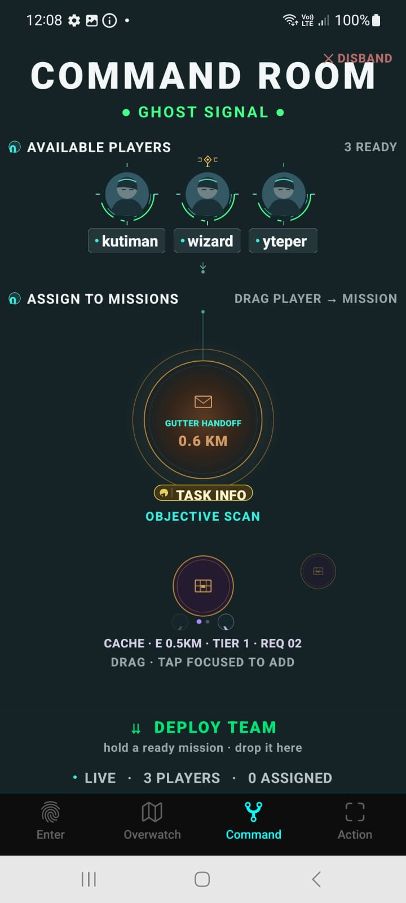
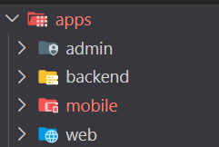
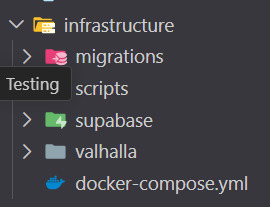

# Masters of the Streets
Masters of the Streets is a real-world urban game built around exploration, discovery, cooperation and competition.

It involves real-time geospatial routing, AR interactions, persistent shared-world state and location-aware game logic.

## Product Visual

  
  &emsp;&emsp;&emsp;&emsp;
  

## My Role

I designed and built the system end to end, spanning the mobile client, backend services, geospatial pipeline, AR interactions and deployment infrastructure.

## Project Structure

### Apps — Product Surfaces

The project is organized as a real multi-surface product rather than a single client:

- `apps/admin` — operational and administrative tooling
- `apps/backend` — API, game logic, real-time services and server authority
- `apps/mobile` — the primary player experience
- `apps/web` — authentication and account lifecycle: sign-in, registration, email verification, password reset and recovery flows

  

### Infrastructure — Production Stack

The repository also contains the infrastructure required to operate the system in production:

- `infrastructure/migrations` — database schema evolution
- `infrastructure/scripts` — operational and maintenance tooling
- `infrastructure/supabase` — authentication and data-platform integration
- `infrastructure/valhalla` — self-hosted routing infrastructure
- Docker Compose and deployment configuration

  

## Core Technology

- React Native · TypeScript
- Node.js · PostgreSQL
- Kotlin · ARCore
- OpenStreetMap · Valhalla
- Docker · Railway

## Engineering Highlights

- Real-world game-object placement constrained by walkability, routing and physical-world hazards
- Self-hosted Valhalla routing over OpenStreetMap data for pedestrian navigation and geospatial snapping
- Native Kotlin / ARCore integration for world-anchored AR interactions
- Persistent multiplayer state with atomic claims, validation and cooperative / competitive game mechanics

## About This Showcase

The production repository is private. This public repository presents selected architecture, engineering decisions and product visuals from the project.
